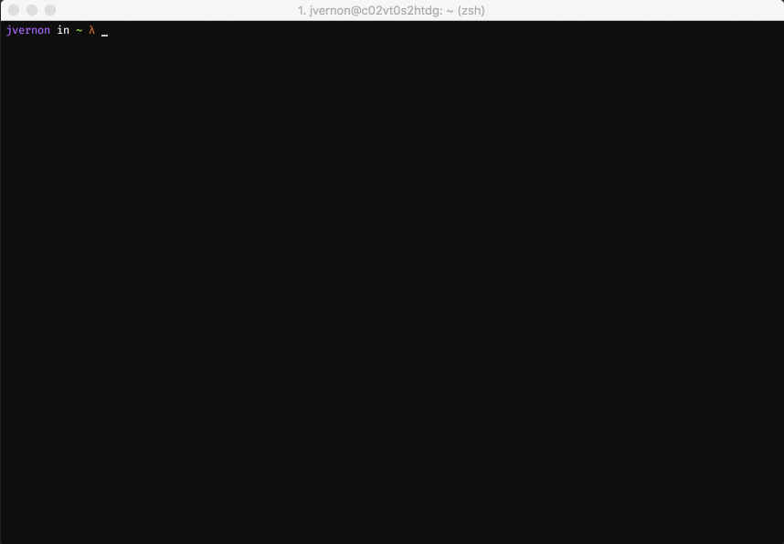

# 💿 cd-recent

> A CLI tool for listing recently visited directories in your UNIX terminal



## Installation

Install `cd-recent` globally to run anytime to find out what the most recent directories you've visited are:
```sh
$ npm i cd-extra -g
```

## Setup

`cd-recent` can be setup to either track recently visited directories dynamically (as you visit them) or retroactively by parsing your history file

_NOTE: parsing your history file retroactively will not produce absolute paths_

### Dynamic Tracking

To enable dynamic tracking of recently visited directories simply run:
```sh
$ cd-recent -t
```

Then override the `cd` builtin by adding the following to your `.bashrc` or `.zshrc`:
```sh
function cd() {
    builtin cd $1
    cd-recent -a $(pwd)
}
```

_NOTE: Dynamic tracking currently only stores a maximum of 1000 recently visited directories_

### Retroactively Tracking

Then easily set the full path to history file:
```sh
$ cd-recent -H [full-path-to-history-file]
```

## Running

List recently visited directories by running (valid directories will be displayed __green__):
```sh
$ cd-extra
```

List a specific number of recently visited directories by running:
```sh
$ cd-recent -l [limit]
```

Set a default number of recently visited directories to list by running:
```sh
$ cd-recent -d [default-limit]
```

Manually add to recently visited directories by running (dynamic tracking must be enabled):
```sh
$ cd-recent -a [full-path-of-directory]
```

Reset recently visit directories by running (dynamic tracking must be enabled):
```sh
$ cd-recent -r
```

## Help

Display the help menu by running:
```sh
$ cd-recent -h

Usage: cd-recent [options]

Options:

  -V, --version                                 output the version number
  -a --add [full path of directory]             adds a recently visited directory to list
  -d --defaultLimit [default limit]             sets default number of recent directories to list
  -H --historyFile [full path to history file]  sets history file to parse when tracking retroactively
  -l --limit [limit]                            sets limit of recent directories to list
  -r --reset                                    reset list of recently visited directories
  -t --toggle                                   toggle dynamic or retroactive recently visited directories tracking
  -h, --help                                    output usage information
```

## Contributing

This project is still in its infancy, so feel free to contribute by reporting issues or suggesting some new features. Pull requests are definitely welcomed!
